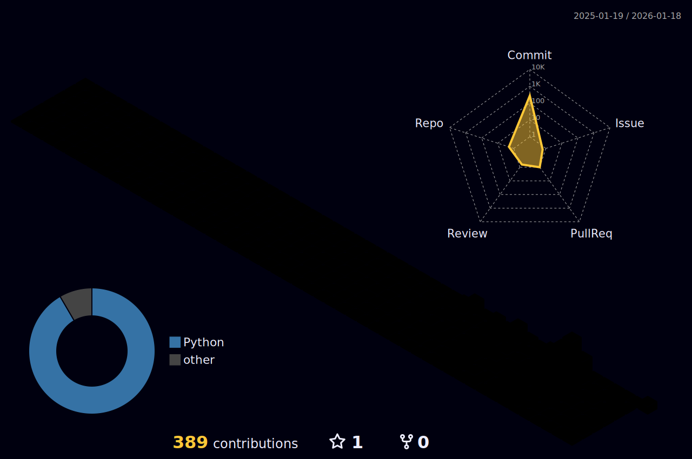

<div align="center">

<!-- HEADER -->


<br>

# Prince L Kansagra


<br>

<span style="color:#C9D1D9">Dallas-Fort Worth, Texas</span> &nbsp;•&nbsp; <span style="color:#C9D1D9">AI @ Microsoft</span> &nbsp;•&nbsp; <span style="color:#C9D1D9">AI @ AT&T</span>

<br>

<!-- SOCIAL -->
<a href="https://www.linkedin.com/in/prince-kansagra/">
  
</a>
&nbsp;
<a href="https://www.kaggle.com/princekansagra">
  
</a>
&nbsp;
<a href="mailto:princekansagra99@gmail.com">
  
</a>
&nbsp;


<br>


<br>

 *"Play your role in life with such passion, that even after the curtains come down, the applause doesn't stop."*

<br>

</div>

## ✍️ Quote of the Day

<!--START_SECTION:quote-->

> *“Build quietly. Ship relentlessly.”*

— Prince

<!--END_SECTION:quote-->

<!-- Divider -->


##  &nbsp;About Me

<div align="center">

<br>

Data Scientist with **6+ years** of experience in **Machine Learning**, **Generative AI**, **Computer Vision**, and **NLP/LLM**.

<br>

| | |
|:--|:--|
| 🏢 **Current** | AI Engineer @ Microsoft \| AI Engineer @ AT&T |
| 🎓 **Education** | MS Business Analytics @ UT Dallas \| BTech Civil @ Nirma University |
| 🌍 **Languages** | English · Hindi · Gujarati · Spanish (Elementary) |
| 🔬 **Focus** | LLM/GenAI · Reinforcement Learning · Azure AI · AI-IoT |

<br>

<br>

### Skill Dots

| Area | Signal |
|:--|:--|
| LLM / GenAI Systems | ●●●●● |
| Computer Vision | ●●●●○ |
| MLOps / Production | ●●●●○ |
| Data Engineering | ●●●○○ |
| Systems / Infra | ●●●○○ |

<sub>Legend: ● = strong, ○ = growing. (These are intentionally conservative so they stay meaningful.)</sub>

</div>


<!-- ══════════════════════════════════════════════════════════════════════════════════════ -->

##  &nbsp;Experience

<div align="center">

<br>

| Company | Role | Duration |
|:--------|:-----|:---------|
|  | **AI Engineer** — LLM, GenAI, Azure Cognitive Services, Copilot | 2023 - 2024 |
|  | **AI Engineer** — Enterprise AI Solutions | 2023 - Present |
|  | **Associate Data Scientist** | 2023 - Present |
|  | **Data Analyst** | 2023 - 2024 |
|  | **Data Scientist** — E-commerce ML, Computer Vision | 2017 - 2021 |

<br>

</div>


<!-- ══════════════════════════════════════════════════════════════════════════════════════ -->

##  &nbsp;Tech Stack

<div align="center">

<br>

<!-- Languages -->
<h3 align="center" style="margin: 0; padding: 0;">Languages</h3>

<a href="https://github.com/Pkansagra-hub?tab=repositories&language=python"></a>&nbsp;
<a href="https://github.com/Pkansagra-hub?tab=repositories&language=r"></a>&nbsp;
<a href="https://github.com/Pkansagra-hub?tab=repositories&q=sql&type=&language=&sort="></a>&nbsp;
<a href="https://github.com/Pkansagra-hub?tab=repositories&q=sas&type=&language=&sort="></a>&nbsp;
<a href="https://github.com/Pkansagra-hub?tab=repositories&q=bash&type=&language=&sort="></a>

<br>

<!-- AI/ML Frameworks -->
<h3 align="center" style="margin: 0; padding: 0;">AI &amp; Machine Learning</h3>

<a href="https://github.com/Pkansagra-hub?tab=repositories&q=pytorch&type=&language=&sort="></a>&nbsp;
<a href="https://github.com/Pkansagra-hub?tab=repositories&q=tensorflow&type=&language=&sort="></a>&nbsp;&nbsp;
<a href="https://huggingface.co/"></a>&nbsp;
<a href="https://openai.com/"></a>&nbsp;
<a href="https://www.anthropic.com/"></a>

<br>

`Transformers` · `LangChain` · `LlamaIndex` · `Semantic Kernel` · `vLLM` · `Ollama`

<br>

<h3 align="center" style="margin: 0; padding: 0;">LLM / SLM</h3>


<br><br>

<h3 align="center" style="margin: 0; padding: 0;">Cloud &amp; Infrastructure</h3>

<a href="https://github.com/Pkansagra-hub?tab=repositories&q=azure&type=&language=&sort="></a>&nbsp;
<a href="https://github.com/Pkansagra-hub?tab=repositories&q=aws&type=&language=&sort="></a>&nbsp;
<a href="https://github.com/Pkansagra-hub?tab=repositories&q=gcp&type=&language=&sort="></a>&nbsp;&nbsp;
<a href="https://github.com/Pkansagra-hub?tab=repositories&q=docker&type=&language=&sort="></a>&nbsp;
<a href="https://github.com/Pkansagra-hub?tab=repositories&q=kubernetes&type=&language=&sort="></a>

<br>

`Azure Cognitive Services` · `AWS SageMaker` · `Microsoft Fabric` · `Databricks`

<br>

<h3 align="center" style="margin: 0; padding: 0;">Big Data &amp; Databases</h3>

<a href="https://github.com/Pkansagra-hub?tab=repositories&language=postgresql"></a>&nbsp;
<a href="https://github.com/Pkansagra-hub?tab=repositories&q=mongodb&type=&language=&sort="></a>&nbsp;
<a href="https://github.com/Pkansagra-hub?tab=repositories&q=redis&type=&language=&sort="></a>&nbsp;&nbsp;
<a href="https://spark.apache.org/"></a>&nbsp;
<a href="https://kafka.apache.org/"></a>&nbsp;
<a href="https://hadoop.apache.org/"></a>

<br>

`Pinecone` · `Weaviate` · `ChromaDB` · `Vector Stores`

<br>

<h3 align="center" style="margin: 0; padding: 0;">MLOps &amp; Tools</h3>

&nbsp;&nbsp;
<a href="https://mlflow.org/"></a>&nbsp;
<a href="https://wandb.ai/"></a>

<br>

`Jupyter` · `Tableau` · `Power BI` · `Git` · `Anaconda`

<br>

</div>


<!-- ══════════════════════════════════════════════════════════════════════════════════════ -->

##  &nbsp;Certifications

<div align="center">

<br>


&nbsp;


<br><br>


&nbsp;


<br><br>


<br>

</div>


<!-- ══════════════════════════════════════════════════════════════════════════════════════ -->

##  &nbsp;Education

<div align="center">

<br>

| Degree | Institution | Year |
|:-------|:------------|:-----|
| **MS Business Analytics** (Minor: Data Science) | The University of Texas at Dallas | 2021 - 2023 |
| **Graduate Certificate** in Applied Machine Learning | The University of Texas at Dallas | 2022 - 2023 |
| **BTech Civil Engineering** | Nirma University, India | 2013 - 2017 |

<br>

🏆 **Dean's Excellence Scholarship** &nbsp;•&nbsp; 🏆 **National Bridge Design Challenge Winner**

<br>

</div>


<!-- ══════════════════════════════════════════════════════════════════════════════════════ -->

## 🎯 2026 Goals

<div align="center">

<br>

| Goal | Status |
|:-----|:------:|
| Build production-grade Memory-First AI System | 🔄 In Progress |
| Contribute to open-source LLM tooling | 🔄 In Progress |
| Publish research on AI memory architectures | ⏳ Planned |
| Launch AI engineering newsletter/blog | ⏳ Planned |
| Master Rust for systems programming | 📚 Learning |

<br>

</div>


<!-- ══════════════════════════════════════════════════════════════════════════════════════ -->

##  &nbsp;Currently Learning

<div align="center">

<br>

📖 **Designing Data-Intensive Applications** — Martin Kleppmann

📖 **Building LLM Powered Applications** — Advanced RAG & Agents

📖 **Rust for Systems Programming** — Memory-safe infrastructure

📖 **Kernel Design Patterns** — For AI system architecture

<br>

</div>


<!-- ══════════════════════════════════════════════════════════════════════════════════════ -->

##  &nbsp;Current Focus

<div align="center">

<br>

| Area | Details |
|:-----|:--------|
| **Kernel-Inspired AI Design** | Idempotency, Write-Ahead Logs, Receipts, Invariants |
| **Memory Architectures** | Episodic, Semantic, Procedural, Prospective — beyond vector search |
| **Agent Orchestration** | Multi-agent planning under strict latency & safety budgets |
| **Long-Horizon Alignment** | AI systems for real humans, not engagement metrics |

<br>

</div>


<!-- ══════════════════════════════════════════════════════════════════════════════════════ -->

##  &nbsp;GitHub Stats

<div align="center">

<br>

<table>
  <tr>
    <td>
      
    </td>
    <td>
      
    </td>
  </tr>
</table>

<br>


<br><br>


<br>

</div>

<br>

### ⏱️ WakaTime Stats

<!--START_SECTION:waka-->

```txt
From: 24 January 2026 - To: 31 January 2026

Total Time: 39 hrs 57 mins

Markdown   13 hrs 54 mins  ████████▓░░░░░░░░░░░░░░░░   34.81 %
Python     13 hrs 33 mins  ████████▒░░░░░░░░░░░░░░░░   33.91 %
Mermaid    11 hrs 18 mins  ███████░░░░░░░░░░░░░░░░░░   28.28 %
Text       30 mins         ▒░░░░░░░░░░░░░░░░░░░░░░░░   01.26 %
JSON       26 mins         ▒░░░░░░░░░░░░░░░░░░░░░░░░   01.12 %
YAML       8 mins          ░░░░░░░░░░░░░░░░░░░░░░░░░   00.37 %
Bash       5 mins          ░░░░░░░░░░░░░░░░░░░░░░░░░   00.21 %
HTML       0 secs          ░░░░░░░░░░░░░░░░░░░░░░░░░   00.01 %
```

<!--END_SECTION:waka-->


<!-- ══════════════════════════════════════════════════════════════════════════════════════ -->

##  &nbsp;Philosophy

<div align="center">

<br>


<br><br>

*Models will change. Frameworks will fade.*

*Memory, governance, and architecture decide what survives.*

<br>

</div>


<!-- ══════════════════════════════════════════════════════════════════════════════════════ -->

<details>
<summary><strong>🔍 &nbsp;The Backstory</strong></summary>

<br>

<div align="center">

From civil engineering to failing UPSC multiple times to designing AI systems at Microsoft and AT&T.

*While most people are still arguing about prompts, I'm building infrastructure.*

</div>

<br>

</details>

<br>

<details>
<summary><strong>🤝 &nbsp;Let's Collaborate</strong></summary>

<br>

<div align="center">

**I want to work with people building:**

<br>

| | |
|:--|:--|
| 🧠 | Memory-centric AI systems *(not chatbot wrappers)* |
| 🔐 | Privacy-first, local-first architectures |
| ⚙️ | Kernel-level AI infrastructure |
| 📊 | Systems where durability, correctness, and governance matter |

<br>

*If that's you — let's talk.*

</div>

<br>

</details>

<br>

<details>
<summary><strong>💼 &nbsp;Top Skills</strong></summary>

<br>

<div align="center">

**Technical Skills**

`Machine Learning` · `Deep Learning` · `NLP/NLU/NLG` · `Computer Vision` · `GenAI/LLM`

`MLOps` · `SDLC` · `Agile` · `GPU/TPU Deployment` · `Batch Processing`

<br>

**Soft Skills**

`Business Ownership` · `Start-up Leadership` · `User Experience (UX)` · `Cross-functional Collaboration`

</div>

<br>

</details>

<br>

<!-- ══════════════════════════════════════════════════════════════════════════════════════ -->

<div align="center">

<br>

### 🌌 3D Contributions

<picture>
  <source media="(prefers-color-scheme: dark)" srcset="./profile-3d-contrib/profile-night-rainbow.svg" />
  <source media="(prefers-color-scheme: light)" srcset="./profile-3d-contrib/profile-season-animate.svg" />
  
</picture>

<br>


<br>

### 🐍 Contribution Graph

<picture>
  <source media="(prefers-color-scheme: dark)" srcset="https://raw.githubusercontent.com/Pkansagra-hub/Pkansagra-hub/output/github-snake-dark.svg" />
  <source media="(prefers-color-scheme: light)" srcset="https://raw.githubusercontent.com/Pkansagra-hub/Pkansagra-hub/output/github-snake.svg" />
  
</picture>

<br><br>


<br>


<br>


</div>
