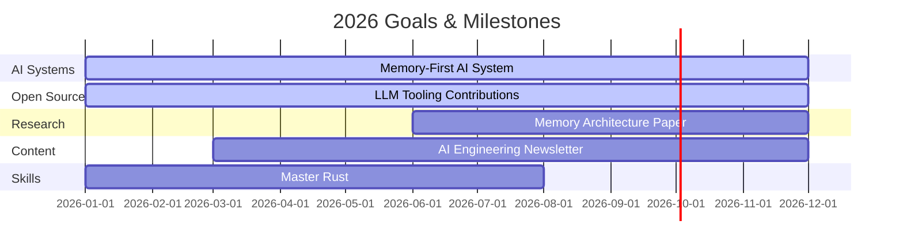

<!-- 
╔════════════════════════════════════════════════════════════════════════════════╗
║                                                                                ║
║                            P R I N C E   K A N S A G R A                       ║
║                                                                                ║
║                    AI Engineer • Systems Architect • Builder                  ║
║                                                                                ║
╚════════════════════════════════════════════════════════════════════════════════╝
-->

<div align="center">

<!-- Header Wave -->


<!-- Dynamic Typing Effect -->
<p align="center">
  
</p>

<!-- Location & Status Badges -->
<p align="center">
  
  
  
</p>

<!-- Social Links -->
<p align="center">
  <a href="https://www.linkedin.com/in/prince-kansagra/">
    
  </a>
  <a href="https://www.kaggle.com/princekansagra">
    
  </a>
  <a href="mailto:princekansagra99@gmail.com">
    
  </a>
  
</p>

<!-- Quote Section -->
<br>

```ascii
╔════════════════════════════════════════════════════════════════════╗
║                                                                    ║
║  "Build quietly. Ship relentlessly."                               ║
║                                                                    ║
║  — Prince                                                          ║
║                                                                    ║
╚════════════════════════════════════════════════════════════════════╝
```

</div>

<br>

<!-- Divider -->


<br>

##  Who I Am

> **Building AI systems that don't just work — they last.**

I'm not your typical AI engineer. My journey from **civil engineering** to **AI systems architecture** taught me something most in this field miss: **the foundation matters more than the facade.**

<div align="center">

```typescript
const prince = {
  // What I Do
  role: "AI Systems Architect & Engineer",
  impact: "Building production AI at scale for Microsoft & AT&T",
  expertise: "Turning bleeding-edge research into battle-tested systems",
  
  // The Difference
  approach: {
    others: "Chase the latest model drop",
    me: "Build memory-first architectures that survive model evolution"
  },
  
  // The Journey
  background: {
    engineering: "BTech Civil Engineering - Systems thinking foundation",
    resilience: "Multiple UPSC failures - Learned persistence",
    mastery: "MS Business Analytics @ UT Dallas - Data science expertise",
    current: "6+ years shipping production AI systems"
  },
  
  // What Drives Me
  philosophy: [
    "Models are ephemeral. Architecture is eternal.",
    "Production > Proof-of-concept",
    "Governance > Algorithms", 
    "Real humans > Engagement metrics"
  ],
  
  // Core Strengths
  strengths: {
    technical: "LLM/GenAI, Computer Vision, MLOps, Production Systems",
    unique: "I think in systems, not just models",
    strategic: "Bridge research → production → business value"
  },
  
  currentMission: () => {
    return [
      "🧠 Memory architectures that go beyond vector search",
      "⚙️ Kernel-inspired AI design (idempotency, WAL, invariants)",
      "🤝 Multi-agent systems under real-world constraints",
      "🎯 AI alignment for actual humans, not metrics"
    ];
  }
};
```

</div>

### 🎯 What Makes Me Different

**Most AI engineers build apps. I build infrastructure.**

While the industry obsesses over the latest model release, I'm solving the problems that matter: **How do we build AI systems that are reliable, governable, and actually serve people?**

<table>
<tr>
<td width="50%" valign="top">

**🏗️ Systems Thinker**
- Engineering background = architecture-first mindset
- I see the whole system, not just the ML layer
- Design for durability, not just deployment

**⚡ Production-Focused**
- 6+ years shipping to real users at enterprise scale
- Microsoft & AT&T trust me with their AI systems
- I know the gap between demo and production

</td>
<td width="50%" valign="top">

**🎓 Research-Informed**
- MS + Graduate Certificate in ML
- Deep understanding of fundamentals + bleeding edge
- I translate papers into production code

**🌉 Bridge Builder**
- Connect research → engineering → business value
- Speak technical, business, and executive
- Make AI accessible without dumbing it down

</td>
</tr>
</table>

### 💪 My Unique Value

```yaml
Technical Excellence:
  - Deep expertise in LLM/GenAI, not just API calls
  - Production MLOps at Microsoft & AT&T scale
  - Computer Vision + NLP + RL - full-stack AI

Strategic Impact:
  - Turn vague AI requirements into concrete systems
  - Build for scalability, governance, and compliance
  - Ship products that generate ROI, not just demos

Team Multiplier:
  - Mentor junior engineers into production contributors
  - Design systems that entire teams can build on
  - Create documentation that actually helps

Long-term Vision:
  - Building memory-first AI architectures
  - Advancing agent orchestration under constraints
  - Researching AI alignment for real-world use
```

### 🌍 Languages & Global Perspective

**Human Languages:** English • Hindi • Gujarati • Spanish (Elementary)  
**Programming Languages:** Python • R • SQL • Bash

*Diverse background = diverse problem-solving approaches*

<br>

<!-- Divider -->


<br>

##  Skill Matrix

<div align="center">

### Core Competencies

<table>
<tr>
<td align="center" width="20%">

<br><strong>Python</strong>
</td>
<td align="center" width="20%">

<br><strong>AWS</strong>
</td>
<td align="center" width="20%">

<br><strong>Docker</strong>
</td>
<td align="center" width="20%">

<br><strong>Kubernetes</strong>
</td>
<td align="center" width="20%">

<br><strong>GitHub</strong>
</td>
</tr>
</table>

### Proficiency Levels

```yaml
AI & Machine Learning:
  LLM/GenAI Systems      : ████████████████████ 100%
  Computer Vision        : ████████████████░░░░  80%
  NLP/NLU                : ████████████████░░░░  80%
  Reinforcement Learning : ██████████████░░░░░░  70%

Engineering & Operations:
  MLOps/Production       : ████████████████░░░░  80%
  Cloud Architecture     : ███████████████░░░░░  75%
  Data Engineering       : ████████████░░░░░░░░  60%
  Systems Programming    : ████████████░░░░░░░░  60%
```

</div>

### 🔧 Technology Arsenal

<details open>
<summary><b>🤖 AI/ML Frameworks & Libraries</b></summary>
<br>

<p align="center">


</p>

**Frameworks:** LangChain • LlamaIndex • Semantic Kernel • Transformers • vLLM • Ollama • AutoGen

**Techniques:** Fine-tuning • LoRA/QLoRA • PEFT • RLHF • RAG • Agents • Function Calling • Prompt Engineering

</details>

<details open>
<summary><b>☁️ Cloud & Infrastructure</b></summary>
<br>

<p align="center">


</p>

**Services:** Azure Cognitive Services • Azure OpenAI • AWS SageMaker • Microsoft Fabric • Databricks • Vertex AI

</details>

<details open>
<summary><b>💾 Data & Databases</b></summary>
<br>

<p align="center">


</p>

**Vector Stores:** Pinecone • Weaviate • ChromaDB • Qdrant • FAISS • Milvus

</details>

<details open>
<summary><b>🛠️ MLOps & DevOps</b></summary>
<br>

<p align="center">


</p>

**Tools:** Jupyter • VS Code • Anaconda • Poetry • Terraform • Prometheus • Grafana

</details>

<br>

<!-- Divider -->


<br>

##  Professional Impact

> **6+ years turning AI research into production systems that scale**

<div align="center">

| 🏢 Company | 💼 Role | 📅 Timeline | 🎯 Key Impact |
|:-----------|:--------|:-----------|:--------------|
|  | **AI Engineer** | 2023 – 2024 | **Led LLM/GenAI initiatives** - Azure Cognitive Services, Copilot integration, enterprise AI deployment at scale |
|  | **AI Engineer** | 2023 – Present | **Building production AI solutions** - Enterprise-grade systems serving millions, MLOps infrastructure |
|  | **Associate Data Scientist** | 2023 – Present | **ML pipeline architecture** - Automated workflows, model deployment, production monitoring |
|  | **Data Analyst** | 2023 – 2024 | **Data-driven insights** - Analytics infrastructure, business intelligence, strategic reporting |
|  | **Data Scientist** | 2017 – 2021 | **E-commerce ML & Computer Vision** - Built recommendation systems, image recognition, customer analytics |

</div>

### 🏆 Career Highlights

<table>
<tr>
<td align="center" width="33%">
<br>
<b>Enterprise Scale</b><br>
<sub>Shipped AI systems serving<br>millions of users at<br>Microsoft & AT&T</sub>
</td>
<td align="center" width="33%">
<br>
<b>Production AI</b><br>
<sub>6+ years building systems<br>that work in the real world,<br>not just demos</sub>
</td>
<td align="center" width="33%">
<br>
<b>Academic Excellence</b><br>
<sub>Dean's Excellence Scholarship<br>MS @ UT Dallas<br>Applied ML expertise</sub>
</td>
</tr>
</table>

<br>

<!-- Divider -->


<br>

##  Education & Credentials

<div align="center">

### 🎓 Academic Background

| Degree | Institution | Year | Honors |
|:-------|:-----------|:-----|:-------|
| **MS Business Analytics**<br><sub>Minor: Data Science</sub> | The University of Texas at Dallas | 2021 – 2023 | 🏆 Dean's Excellence Scholarship |
| **Graduate Certificate**<br><sub>Applied Machine Learning</sub> | The University of Texas at Dallas | 2022 – 2023 | - |
| **BTech Civil Engineering** | Nirma University, India | 2013 – 2017 | 🏆 National Bridge Design Challenge Winner |

<br>

### 📜 Professional Certifications

<p>


</p>

<p>


</p>

</div>

<br>

<!-- Divider -->


<br>

##  Current Focus & Vision

<div align="center">

### 🎯 Active Research Areas

<table>
<tr>
<td align="center" width="25%">
<br>
<b>Memory Architectures</b><br>
<sub>Episodic, Semantic,<br>Procedural, Prospective</sub>
</td>
<td align="center" width="25%">
<br>
<b>Kernel-Inspired AI</b><br>
<sub>Idempotency, WAL,<br>Receipts, Invariants</sub>
</td>
<td align="center" width="25%">
<br>
<b>Agent Orchestration</b><br>
<sub>Multi-agent planning<br>under constraints</sub>
</td>
<td align="center" width="25%">
<br>
<b>AI Alignment</b><br>
<sub>Long-horizon systems<br>for real humans</sub>
</td>
</tr>
</table>

<br>

### 📚 Current Reading List

| Book | Author | Focus |
|:-----|:-------|:------|
| 📖 **Designing Data-Intensive Applications** | Martin Kleppmann | System Architecture |
| 📖 **Building LLM Powered Applications** | Various | Advanced RAG & Agents |
| 📖 **Rust for Systems Programming** | Various | Memory-safe Infrastructure |
| 📖 **Kernel Design Patterns** | Various | AI System Architecture |

<br>

### 🚀 2026 Roadmap


```mermaid
gantt
    title 2026 Goals & Milestones
    dateFormat  YYYY-MM
    section AI Systems
    Memory-First AI System           :active, 2026-01, 2026-12
    section Open Source
    LLM Tooling Contributions        :active, 2026-01, 2026-12
    section Research
    Memory Architecture Paper        : 2026-06, 2026-12
    section Content
    AI Engineering Newsletter        : 2026-03, 2026-12
    section Skills
    Master Rust                      : 2026-01, 2026-08
```

| Goal | Status | Priority |
|:-----|:------:|:--------:|
| Build production-grade Memory-First AI System | 🔄 In Progress | 🔴 High |
| Contribute to open-source LLM tooling | 🔄 In Progress | 🟡 Medium |
| Publish research on AI memory architectures | ⏳ Planned | 🟡 Medium |
| Launch AI engineering newsletter/blog | ⏳ Planned | 🟢 Low |
| Master Rust for systems programming | 📚 Learning | 🟡 Medium |

</div>

<br>

<!-- Divider -->


<br>

##  GitHub Analytics

<div align="center">

<!-- Main Stats Row -->
<a href="https://github.com/Pkansagra-hub">
  
</a>

<a href="https://github.com/Pkansagra-hub">
  
</a>

<br><br>

<!-- Streak Stats -->
<a href="https://github.com/Pkansagra-hub">
  
</a>

<br><br>

<!-- Activity Graph -->
<a href="https://github.com/Pkansagra-hub">
  
</a>

<br>

### ⏱️ Weekly Development Breakdown

<!--START_SECTION:waka-->
```txt
From: 03 February 2026 - To: 10 February 2026

Total Time: 61 hrs 13 mins

Markdown   35 hrs 17 mins  ██████████████▒░░░░░░░░░░   57.63 %
Mermaid    13 hrs 14 mins  █████▒░░░░░░░░░░░░░░░░░░░   21.61 %
Python     11 hrs 53 mins  █████░░░░░░░░░░░░░░░░░░░░   19.41 %
Bash       16 mins         ░░░░░░░░░░░░░░░░░░░░░░░░░   00.46 %
YAML       11 mins         ░░░░░░░░░░░░░░░░░░░░░░░░░   00.30 %
JSON       9 mins          ░░░░░░░░░░░░░░░░░░░░░░░░░   00.25 %
Text       6 mins          ░░░░░░░░░░░░░░░░░░░░░░░░░   00.18 %
HTML       5 mins          ░░░░░░░░░░░░░░░░░░░░░░░░░   00.14 %
```
<!--END_SECTION:waka-->

<br>

### 🐍 Contribution Snake

<picture>
  <source media="(prefers-color-scheme: dark)" srcset="https://raw.githubusercontent.com/Pkansagra-hub/Pkansagra-hub/output/github-snake-dark.svg" />
  <source media="(prefers-color-scheme: light)" srcset="https://raw.githubusercontent.com/Pkansagra-hub/Pkansagra-hub/output/github-snake.svg" />
  
</picture>

<br></div>

<br>

<!-- Divider -->


<br>

##  Philosophy & Vision

<div align="center">

```ascii
╔═══════════════════════════════════════════════════════════════════════════╗
║                                                                           ║
║   "I don't build apps. I build systems that outlive trends."             ║
║                                                                           ║
║   While others chase models, I architect foundations.                    ║
║   While others ship demos, I deploy to production.                       ║
║   While others optimize for hype, I engineer for humans.                 ║
║                                                                           ║
╚═══════════════════════════════════════════════════════════════════════════╝
```

<br>

### 🎭 The Unconventional Journey

**Civil Engineering** → **Multiple UPSC Failures** → **AI Systems Architect at Microsoft & AT&T**

This path wasn't linear. It was instructive.

- **Engineering taught me:** Systems thinking, structural integrity, foundations matter
- **Failures taught me:** Resilience, humility, iteration over perfection  
- **AI gave me:** The canvas to build systems that actually help people

*Most people in AI are arguing about prompts. I'm building infrastructure.*

<br>

### 💡 Core Principles

<table>
<tr>
<td align="center" width="25%">
<br>
<b>Architecture First</b><br>
<sub>Models will change.<br>Your foundation won't.</sub>
</td>
<td align="center" width="25%">
<br>
<b>Production Over Proof</b><br>
<sub>Ship systems that work,<br>not demos that impress.</sub>
</td>
<td align="center" width="25%">
<br>
<b>Humans Over Metrics</b><br>
<sub>Optimize for actual people,<br>not engagement scores.</sub>
</td>
<td align="center" width="25%">
<br>
<b>Durability Over Speed</b><br>
<sub>Build to last,<br>not just to launch.</sub>
</td>
</tr>
</table>

<br>

### 🚀 What I'm Building For

**The next decade of AI won't be won by the best model.**  
It'll be won by the best **memory, governance, and architecture.**

I'm working on:
- 🧠 **Memory systems** that learn and recall like humans do
- ⚙️ **Kernel-level AI** with idempotency, write-ahead logs, invariants
- 🤝 **Agent orchestration** that works under real-world constraints
- 🎯 **Aligned AI** that serves humans, not metrics

<br>

> **"In 10 years, no one will remember which model you used.**  
> **They'll remember if your system actually worked."**

</div>

<br>

<!-- Divider -->


<br>

##  Let's Build Something That Matters

<div align="center">

### 🤝 I Want to Work With People Who...

<table>
<tr>
<td align="center" width="25%">
<br>
<b>Build Systems,<br>Not Wrappers</b><br>
<sub>Memory-centric AI<br>beyond chatbot demos</sub>
</td>
<td align="center" width="25%">
<br>
<b>Value Privacy<br>& Ownership</b><br>
<sub>Local-first, privacy-first<br>architectures</sub>
</td>
<td align="center" width="25%">
<br>
<b>Care About<br>Foundations</b><br>
<sub>Kernel-level infrastructure<br>that lasts</sub>
</td>
<td align="center" width="25%">
<br>
<b>Ship Production,<br>Not Demos</b><br>
<sub>Durability, correctness,<br>governance matter</sub>
</td>
</tr>
</table>

<br>

### 💼 What I Bring to Collaborations

```python
class Collaboration:
    def what_i_offer(self):
        return {
            "technical": [
                "6+ years production AI experience at enterprise scale",
                "Deep LLM/GenAI expertise (not just API wrappers)",
                "Full-stack: Research → Engineering → Deployment",
                "MLOps infrastructure that actually works"
            ],
            
            "strategic": [
                "Bridge technical complexity with business value",
                "Turn vague requirements into concrete systems", 
                "Design for scale, compliance, and governance",
                "Make AI accessible without oversimplifying"
            ],
            
            "collaborative": [
                "Mentor teams into high performers",
                "Document systems that help, not hinder",
                "Build foundations others can extend",
                "Communicate across technical levels"
            ]
        }
    
    def what_im_looking_for(self):
        return {
            "projects": [
                "🧠 Memory architectures beyond vector search",
                "🔐 Privacy-preserving AI systems",
                "⚙️ Infrastructure for long-term AI systems",
                "🎯 AI that helps real humans solve real problems"
            ],
            
            "values": [
                "Quality over speed",
                "Architecture over algorithms", 
                "Long-term over short-term hype",
                "Human impact over engagement metrics"
            ]
        }
```

<br>

### 🎯 Perfect Collaboration Looks Like...

**You have:** A hard problem that needs production AI, not just a demo  
**I bring:** Systems thinking + deep technical expertise + execution ability  
**We build:** Something that works in the real world and lasts beyond the next model release

**If you're building where governance, memory, and architecture matter more than the latest model drop — let's talk.**

<br>

### 📬 Get In Touch

<p>
<a href="https://www.linkedin.com/in/prince-kansagra/">

</a>
<a href="mailto:princekansagra99@gmail.com">

</a>
<a href="https://www.kaggle.com/princekansagra">

</a>
</p>

**Response time:** Within 24 hours for serious opportunities  
**Best for:** Production AI projects, architecture consulting, technical leadership

</div>

<br>

<!-- Divider -->


<br>

<!-- Expandable Sections -->
<details>
<summary><b>🔍 The Full Story</b></summary>
<br>

### From Civil Engineering to AI Infrastructure

My journey is unconventional. Started with a BTech in Civil Engineering, spent years preparing for UPSC (Indian civil services), failed multiple times, then pivoted completely into data science and AI.

**The failures taught me:**
- Systems thinking from engineering
- Resilience from repeated failures
- Focus from years of preparation
- Humility from starting over

**Now I build:**
- Production AI systems at Microsoft & AT&T
- Infrastructure that outlasts trends
- Memory-first architectures
- Systems for real humans, not demos

The path was messy. The destination makes it worth it.

</details>

<details>
<summary><b>💼 Technical Deep Dive</b></summary>
<br>

### Core Technical Skills

**Machine Learning & AI:**
- Deep Learning (CNN, RNN, LSTM, Transformers)
- Natural Language Processing (NER, Sentiment Analysis, Text Generation)
- Computer Vision (Object Detection, Image Segmentation, OCR)
- Reinforcement Learning (Q-Learning, Policy Gradients)
- Generative AI (GPT, BERT, Claude, Stable Diffusion)

**LLM Engineering:**
- Fine-tuning & Transfer Learning (LoRA, QLoRA, PEFT)
- Prompt Engineering & Optimization
- RAG (Retrieval-Augmented Generation)
- Agent Systems & Tool Use
- Context Management & Memory Systems

**MLOps & Production:**
- Model Deployment (REST APIs, gRPC, Streaming)
- Containerization (Docker, Kubernetes)
- Orchestration (Airflow, Kubeflow, MLflow)
- Monitoring & Observability (Prometheus, Grafana)
- CI/CD for ML (GitHub Actions, Jenkins)

**Data Engineering:**
- ETL Pipelines (Apache Spark, Airflow)
- Streaming (Kafka, Kinesis)
- Data Warehousing (Snowflake, BigQuery)
- Feature Stores (Feast, Tecton)

**Soft Skills:**
- Technical Leadership
- Cross-functional Collaboration
- System Design & Architecture
- Business Ownership
- Startup Mindset

</details>

<details>
<summary><b>🌟 Quote of the Day</b></summary>
<br>

<!--START_SECTION:quote-->

> *"Build quietly. Ship relentlessly."*

— Prince

<!--END_SECTION:quote-->

</details>

<br>

<!-- Footer -->
<div align="center">


<br><br>

<!-- Footer Wave -->


</div>
