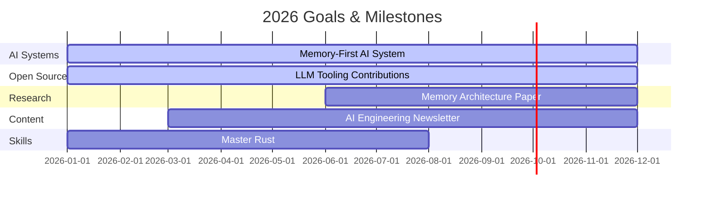
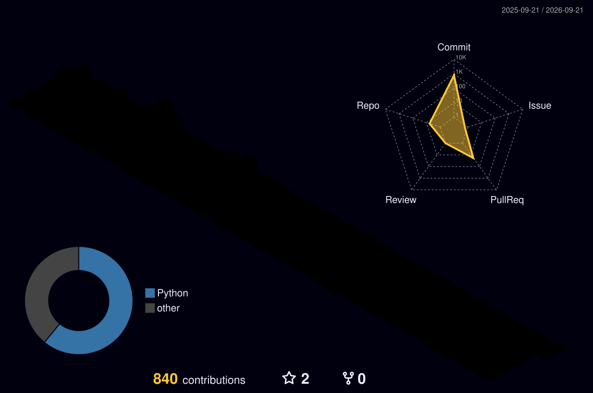

<!-- 
╔════════════════════════════════════════════════════════════════════════════════╗
║                                                                                ║
║                            P R I N C E   K A N S A G R A                       ║
║                                                                                ║
║                    AI Engineer • Systems Architect • Builder                  ║
║                                                                                ║
╚════════════════════════════════════════════════════════════════════════════════╝
-->

<div align="center">

<!-- Header Wave -->


<!-- Dynamic Typing Effect -->
<p align="center">
  
</p>

<!-- Location & Status Badges -->
<p align="center">
  
  
  
</p>

<!-- Social Links -->
<p align="center">
  <a href="https://www.linkedin.com/in/prince-kansagra/">
    
  </a>
  <a href="https://www.kaggle.com/princekansagra">
    
  </a>
  <a href="mailto:princekansagra99@gmail.com">
    
  </a>
  
</p>

<!-- Quote Section -->
<br>

```ascii
╔════════════════════════════════════════════════════════════════════╗
║                                                                    ║
║  "Build quietly. Ship relentlessly."                               ║
║                                                                    ║
║  — Prince                                                          ║
║                                                                    ║
╚════════════════════════════════════════════════════════════════════╝
```

</div>

<br>

<!-- Divider -->


<br>

##  About Me

```typescript
const prince = {
  role: "AI Engineer & Systems Architect",
  companies: ["Microsoft", "AT&T", "Infosys", "TCS"],
  location: "Dallas-Fort Worth, Texas 🇺🇸",
  
  education: {
    masters: "MS Business Analytics @ UT Dallas",
    bachelor: "BTech Civil Engineering @ Nirma University",
    specialization: ["Data Science", "Applied Machine Learning"]
  },
  
  expertise: {
    primary: ["LLM/GenAI", "Computer Vision", "NLP"],
    systems: ["MLOps", "AI Infrastructure", "Cloud Architecture"],
    focus: "Building production AI that outlives trends"
  },
  
  languages: {
    human: ["English", "Hindi", "Gujarati", "Spanish"],
    programming: ["Python", "R", "SQL", "Bash"]
  },
  
  philosophy: "Models change. Frameworks fade. Architecture survives.",
  
  currentMission: () => {
    return [
      "Kernel-inspired AI design (idempotency, WAL, invariants)",
      "Memory architectures beyond vector search",
      "Multi-agent orchestration with strict constraints",
      "Long-horizon alignment for real humans"
    ];
  }
};
```

<br>

<!-- Divider -->


<br>

##  Skill Matrix

<div align="center">

### Core Competencies

<table>
<tr>
<td align="center" width="20%">

<br><strong>Python</strong>
</td>
<td align="center" width="20%">

<br><strong>AWS</strong>
</td>
<td align="center" width="20%">

<br><strong>Docker</strong>
</td>
<td align="center" width="20%">

<br><strong>Kubernetes</strong>
</td>
<td align="center" width="20%">

<br><strong>GitHub</strong>
</td>
</tr>
</table>

### Proficiency Levels

```yaml
AI & Machine Learning:
  LLM/GenAI Systems      : ████████████████████ 100%
  Computer Vision        : ████████████████░░░░  80%
  NLP/NLU                : ████████████████░░░░  80%
  Reinforcement Learning : ██████████████░░░░░░  70%

Engineering & Operations:
  MLOps/Production       : ████████████████░░░░  80%
  Cloud Architecture     : ███████████████░░░░░  75%
  Data Engineering       : ████████████░░░░░░░░  60%
  Systems Programming    : ████████████░░░░░░░░  60%
```

</div>

### 🔧 Technology Stack

<details open>
<summary><b>🤖 AI/ML Frameworks</b></summary>
<br>


**Frameworks:** LangChain • LlamaIndex • Semantic Kernel • Transformers • vLLM • Ollama • AutoGen

**Techniques:** Fine-tuning • LoRA/QLoRA • PEFT • RLHF • RAG • Agents • Function Calling • Prompt Engineering

</details>

<details>
<summary><b>☁️ Cloud & Infrastructure</b></summary>
<br>


**Services:** Azure Cognitive Services • Azure OpenAI • AWS SageMaker • Microsoft Fabric • Databricks • Vertex AI

</details>

<details>
<summary><b>💾 Data & Databases</b></summary>
<br>


**Vector Stores:** Pinecone • Weaviate • ChromaDB • Qdrant • FAISS • Milvus

</details>

<details>
<summary><b>🛠️ MLOps & DevOps</b></summary>
<br>


**Tools:** Jupyter • VS Code • Anaconda • Poetry • Terraform • Prometheus • Grafana

</details>

<br>

<!-- Divider -->


<br>

##  Professional Journey

<div align="center">

| 🏢 Company | 💼 Role | 📅 Timeline | 🎯 Focus |
|:-----------|:--------|:-----------|:---------|
|  | **AI Engineer** | 2023 – 2024 | LLM, GenAI, Azure Cognitive Services, Copilot |
|  | **AI Engineer** | 2023 – Present | Enterprise AI Solutions, Production Systems |
|  | **Associate Data Scientist** | 2023 – Present | ML Pipeline Development |
|  | **Data Analyst** | 2023 – 2024 | Data Analytics & Insights |
|  | **Data Scientist** | 2017 – 2021 | E-commerce ML, Computer Vision |

</div>

<br>

<!-- Divider -->


<br>

##  Education & Credentials

<div align="center">

### 🎓 Academic Background

| Degree | Institution | Year | Honors |
|:-------|:-----------|:-----|:-------|
| **MS Business Analytics**<br><sub>Minor: Data Science</sub> | The University of Texas at Dallas | 2021 – 2023 | 🏆 Dean's Excellence Scholarship |
| **Graduate Certificate**<br><sub>Applied Machine Learning</sub> | The University of Texas at Dallas | 2022 – 2023 | - |
| **BTech Civil Engineering** | Nirma University, India | 2013 – 2017 | 🏆 National Bridge Design Challenge Winner |

<br>

### 📜 Professional Certifications

<p>


</p>

<p>


</p>

</div>

<br>

<!-- Divider -->


<br>

##  Current Focus & Vision

<div align="center">

### 🎯 Active Research Areas

<table>
<tr>
<td align="center" width="25%">
<br>
<b>Memory Architectures</b><br>
<sub>Episodic, Semantic,<br>Procedural, Prospective</sub>
</td>
<td align="center" width="25%">
<br>
<b>Kernel-Inspired AI</b><br>
<sub>Idempotency, WAL,<br>Receipts, Invariants</sub>
</td>
<td align="center" width="25%">
<br>
<b>Agent Orchestration</b><br>
<sub>Multi-agent planning<br>under constraints</sub>
</td>
<td align="center" width="25%">
<br>
<b>AI Alignment</b><br>
<sub>Long-horizon systems<br>for real humans</sub>
</td>
</tr>
</table>

<br>

### 📚 Current Reading List

| Book | Author | Focus |
|:-----|:-------|:------|
| 📖 **Designing Data-Intensive Applications** | Martin Kleppmann | System Architecture |
| 📖 **Building LLM Powered Applications** | Various | Advanced RAG & Agents |
| 📖 **Rust for Systems Programming** | Various | Memory-safe Infrastructure |
| 📖 **Kernel Design Patterns** | Various | AI System Architecture |

<br>

### 🚀 2026 Roadmap


```mermaid
gantt
    title 2026 Goals & Milestones
    dateFormat  YYYY-MM
    section AI Systems
    Memory-First AI System           :active, 2026-01, 2026-12
    section Open Source
    LLM Tooling Contributions        :active, 2026-01, 2026-12
    section Research
    Memory Architecture Paper        : 2026-06, 2026-12
    section Content
    AI Engineering Newsletter        : 2026-03, 2026-12
    section Skills
    Master Rust                      : 2026-01, 2026-08
```

| Goal | Status | Priority |
|:-----|:------:|:--------:|
| Build production-grade Memory-First AI System | 🔄 In Progress | 🔴 High |
| Contribute to open-source LLM tooling | 🔄 In Progress | 🟡 Medium |
| Publish research on AI memory architectures | ⏳ Planned | 🟡 Medium |
| Launch AI engineering newsletter/blog | ⏳ Planned | 🟢 Low |
| Master Rust for systems programming | 📚 Learning | 🟡 Medium |

</div>

<br>

<!-- Divider -->


<br>

##  GitHub Analytics

<div align="center">

<!-- Stats Cards -->
<a href="https://github.com/Pkansagra-hub">
  
  
</a>

<br><br>

<!-- Streak Stats -->
<a href="https://github.com/Pkansagra-hub">
  
</a>

<br><br>

<!-- Activity Graph -->
<a href="https://github.com/Pkansagra-hub">
  
</a>

<br>

### ⏱️ Weekly Development Breakdown

<!--START_SECTION:waka-->

```txt
From: 04 February 2026 - To: 11 February 2026

Total Time: 61 hrs 11 mins

Markdown   35 hrs 12 mins  ██████████████▒░░░░░░░░░░   57.54 %
Mermaid    13 hrs 41 mins  █████▓░░░░░░░░░░░░░░░░░░░   22.38 %
Python     11 hrs 9 mins   ████▓░░░░░░░░░░░░░░░░░░░░   18.23 %
Bash       16 mins         ░░░░░░░░░░░░░░░░░░░░░░░░░   00.46 %
YAML       11 mins         ░░░░░░░░░░░░░░░░░░░░░░░░░   00.33 %
Rust       10 mins         ░░░░░░░░░░░░░░░░░░░░░░░░░   00.30 %
Text       10 mins         ░░░░░░░░░░░░░░░░░░░░░░░░░   00.28 %
JSON       9 mins          ░░░░░░░░░░░░░░░░░░░░░░░░░   00.25 %
```

<!--END_SECTION:waka-->

<br>

### 🐍 Contribution Snake

<picture>
  <source media="(prefers-color-scheme: dark)" srcset="https://raw.githubusercontent.com/Pkansagra-hub/Pkansagra-hub/output/github-snake-dark.svg" />
  <source media="(prefers-color-scheme: light)" srcset="https://raw.githubusercontent.com/Pkansagra-hub/Pkansagra-hub/output/github-snake.svg" />
  
</picture>

<br><br>

### 🌌 3D Contribution Graph

<picture>
  <source media="(prefers-color-scheme: dark)" srcset="./profile-3d-contrib/profile-night-rainbow.svg" />
  <source media="(prefers-color-scheme: light)" srcset="./profile-3d-contrib/profile-season-animate.svg" />
  
</picture>

</div>

<br>

<!-- Divider -->


<br>

##  Philosophy & Vision

<div align="center">

```ascii
╔═══════════════════════════════════════════════════════════════════════════╗
║                                                                           ║
║   "I don't build apps. I build systems that outlive trends."             ║
║                                                                           ║
║   Models will change. Frameworks will fade.                              ║
║   Memory, governance, and architecture decide what survives.             ║
║                                                                           ║
╚═══════════════════════════════════════════════════════════════════════════╝
```

<br>

### 🎭 The Journey

**From civil engineering** → failing UPSC multiple times → **designing AI systems at Microsoft & AT&T**

*While most people are still arguing about prompts, I'm building infrastructure.*

<br>

### 💡 Core Beliefs

> **Quality over Hype** — Build systems that matter, not just demos  
> **Architecture over Algorithms** — The foundation outlasts the implementation  
> **Durability over Speed** — Ship production-grade, not proof-of-concept  
> **Humans over Metrics** — AI should serve people, not engagement scores

</div>

<br>

<!-- Divider -->


<br>

##  Let's Collaborate

<div align="center">

### 🤝 Looking to Build With

I'm interested in collaborating on projects involving:

<table>
<tr>
<td align="center" width="25%">
🧠<br><b>Memory-Centric AI</b><br>
<sub>Not chatbot wrappers</sub>
</td>
<td align="center" width="25%">
🔐<br><b>Privacy-First Systems</b><br>
<sub>Local-first architectures</sub>
</td>
<td align="center" width="25%">
⚙️<br><b>Kernel-Level AI</b><br>
<sub>Infrastructure that lasts</sub>
</td>
<td align="center" width="25%">
📊<br><b>Production Systems</b><br>
<sub>Durability & correctness matter</sub>
</td>
</tr>
</table>

<br>

**If you're building systems where governance, memory, and architecture matter more than the latest model — let's talk.**

<br>

### 📬 Reach Out

<p>
<a href="https://www.linkedin.com/in/prince-kansagra/"></a>
<a href="mailto:princekansagra99@gmail.com"></a>
<a href="https://www.kaggle.com/princekansagra"></a>
</p>

</div>

<br>

<!-- Divider -->


<br>

<!-- Expandable Sections -->
<details>
<summary><b>🔍 The Full Story</b></summary>
<br>

### From Civil Engineering to AI Infrastructure

My journey is unconventional. Started with a BTech in Civil Engineering, spent years preparing for UPSC (Indian civil services), failed multiple times, then pivoted completely into data science and AI.

**The failures taught me:**
- Systems thinking from engineering
- Resilience from repeated failures
- Focus from years of preparation
- Humility from starting over

**Now I build:**
- Production AI systems at Microsoft & AT&T
- Infrastructure that outlasts trends
- Memory-first architectures
- Systems for real humans, not demos

The path was messy. The destination makes it worth it.

</details>

<details>
<summary><b>💼 Technical Deep Dive</b></summary>
<br>

### Core Technical Skills

**Machine Learning & AI:**
- Deep Learning (CNN, RNN, LSTM, Transformers)
- Natural Language Processing (NER, Sentiment Analysis, Text Generation)
- Computer Vision (Object Detection, Image Segmentation, OCR)
- Reinforcement Learning (Q-Learning, Policy Gradients)
- Generative AI (GPT, BERT, Claude, Stable Diffusion)

**LLM Engineering:**
- Fine-tuning & Transfer Learning (LoRA, QLoRA, PEFT)
- Prompt Engineering & Optimization
- RAG (Retrieval-Augmented Generation)
- Agent Systems & Tool Use
- Context Management & Memory Systems

**MLOps & Production:**
- Model Deployment (REST APIs, gRPC, Streaming)
- Containerization (Docker, Kubernetes)
- Orchestration (Airflow, Kubeflow, MLflow)
- Monitoring & Observability (Prometheus, Grafana)
- CI/CD for ML (GitHub Actions, Jenkins)

**Data Engineering:**
- ETL Pipelines (Apache Spark, Airflow)
- Streaming (Kafka, Kinesis)
- Data Warehousing (Snowflake, BigQuery)
- Feature Stores (Feast, Tecton)

**Soft Skills:**
- Technical Leadership
- Cross-functional Collaboration
- System Design & Architecture
- Business Ownership
- Startup Mindset

</details>

<details>
<summary><b>🌟 Quote of the Day</b></summary>
<br>

<!--START_SECTION:quote-->

> *"Build quietly. Ship relentlessly."*

— Prince

<!--END_SECTION:quote-->

</details>

<br>

<!-- Footer -->
<div align="center">


<br><br>

<!-- Footer Wave -->


</div>
