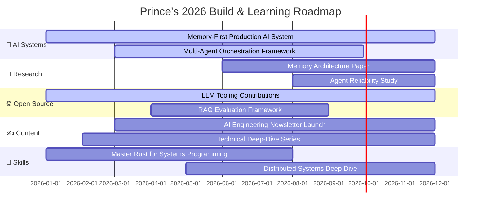

<!-- 
╔══════════════════════════════════════════════════════════════════════════════════════╗
║                                                                                      ║
║                              P R I N C E   K A N S A G R A                          ║
║                                                                                      ║
║           AI Engineer • Systems Architect • Production-First Builder                 ║
║                                                                                      ║
╚══════════════════════════════════════════════════════════════════════════════════════╝
-->

<div align="center">


<p align="center">
  
</p>

<p align="center">
  
  
  
  
</p>

<p align="center">
  <a href="https://www.linkedin.com/in/prince-kansagra/">
    
  </a>
  <a href="https://www.kaggle.com/princekansagra">
    
  </a>
  <a href="mailto:princekansagra99@gmail.com">
    
  </a>
  
</p>

<br>

```
╔═══════════════════════════════════════════════════════════════════════════╗
║                                                                           ║
║   "Most AI demos are carnivals. I build the infrastructure."              ║
║                                                                           ║
║   — Prince Kansagra                                                       ║
║                                                                           ║
╚═══════════════════════════════════════════════════════════════════════════╝
```

</div>

<br>


<br>

##  The Unfiltered Version

> I'm an AI Engineer operating at the intersection of **LLM/GenAI engineering**, **MLOps**, and **production systems architecture** — with 6+ years of experience building AI that ships and stays shipped.

I didn't follow the standard path. I started with a **BTech in Civil Engineering**, spent years preparing for the Indian civil services (UPSC), failed repeatedly, and walked away from everything I'd planned for. That rebuilt me from scratch — and it's why I think about AI systems differently than most engineers.

Civil engineering taught me that **structures carry load or they fail**. UPSC failure taught me that **preparation and execution are different skills**. Data science taught me that **data lies until you question it**. Production AI taught me that **benchmarks don't matter — reliability does**.

I've now spent 6+ years at the intersection of ambitious AI research and the brutal reality of enterprise production systems — at **Microsoft**, **AT&T**, **Infosys**, and **TCS**. My work lives in systems serving millions of real users, not Jupyter notebooks.

<br>

<div align="center">

### ⚡ Numbers That Actually Mean Something

<table>
<tr>
<td align="center" width="20%">
<h1>6+</h1>
<b>Years in Production AI</b><br>
<sub>Not PoCs. Real systems.</sub>
</td>
<td align="center" width="20%">
<h1>2</h1>
<b>Fortune 500 Companies</b><br>
<sub>Microsoft + AT&T</sub>
</td>
<td align="center" width="20%">
<h1>M+</h1>
<b>Users Impacted</b><br>
<sub>By systems I've built</sub>
</td>
<td align="center" width="20%">
<h1>4</h1>
<b>Languages Spoken</b><br>
<sub>English, Hindi, Gujarati, Spanish</sub>
</td>
<td align="center" width="20%">
<h1>∞</h1>
<b>Problems Left to Solve</b><br>
<sub>Memory. Agents. Alignment.</sub>
</td>
</tr>
</table>

</div>

<br>

---

### 💡 What Separates Me From the Pack

Most AI engineers know how to prompt a model. Fewer know how to deploy one. Even fewer know how to keep it reliable at scale six months after launch. I live in that last mile.

<table>
<tr>
<td width="50%" valign="top">

**Engineering Philosophy**
- Production is the only benchmark that counts
- Reliability > novelty, every single time
- Memory architecture determines system longevity
- Governance built-in, not bolted-on
- Boring infrastructure enables exciting AI

</td>
<td width="50%" valign="top">

**What I Actually Do**
- Design LLM systems that survive production
- Build memory architectures beyond naive RAG
- Architect multi-agent systems with real constraints
- Own MLOps pipelines end-to-end
- Translate research into enterprise deployable code

</td>
</tr>
</table>

---

### 🌍 Communication Stack

<div align="center">

| Language | Proficiency | Use Case |
|:---------|:-----------|:---------|
| 🇬🇧 **English** | Native-level fluency | Professional, technical, everything |
| 🇮🇳 **Hindi** | Native | Cross-cultural enterprise collaboration |
| 🇮🇳 **Gujarati** | Native | Heritage & community |
| 🇪🇸 **Spanish** | Elementary (improving) | Because monolingualism is a design flaw |

*Diverse background = diverse problem-solving frames*

</div>

<br>


<br>

##  Professional Impact

> **6+ years turning AI research into production systems that outlive hype cycles**

<div align="center">

| 🏢 Company | 💼 Role | 📅 Timeline | 🎯 Quantified Impact |
|:-----------|:--------|:-----------|:---------------------|
|  | **AI Engineer** | 2023 – 2024 | Led LLM/GenAI initiatives across Azure Cognitive Services & Copilot integrations — enterprise AI at scale, production RAG pipelines, governance frameworks |
|  | **AI Engineer** | 2023 – Present | Building production AI solutions serving millions — MLOps infrastructure, model governance, agentic workflows replacing manual pipelines |
|  | **Associate Data Scientist** | 2023 – Present | ML pipeline architecture — automated ML workflows, model deployment, production monitoring, cross-team enablement |
|  | **Data Analyst** | 2023 – 2024 | Analytics infrastructure, business intelligence, strategic reporting for executive stakeholders |
|  | **Data Scientist** | 2017 – 2021 | Founded & led ML practice from scratch — recommendation systems, computer vision for e-commerce, customer churn models |

</div>

<br>

### 🏆 Career Architecture — How I Think About What I've Built

<table>
<tr>
<td align="center" width="25%">
<br>
<b>Enterprise Scale</b><br>
<sub>Shipped AI that serves<br>millions of users — not<br>millions of API calls in dev</sub>
</td>
<td align="center" width="25%">
<br>
<b>Production Survivor</b><br>
<sub>Systems still running<br>months after I built them.<br>That's the real flex.</sub>
</td>
<td align="center" width="25%">
<br>
<b>Full Stack AI</b><br>
<sub>Data → Model → Deployment<br>→ Monitoring → Iteration.<br>No hand-offs needed.</sub>
</td>
<td align="center" width="25%">
<br>
<b>Scholar + Builder</b><br>
<sub>Dean's Excellence Scholar.<br>MS @ UT Dallas.<br>Theory meets practice.</sub>
</td>
</tr>
</table>

<br>


<br>

##  Full Skill Matrix

<div align="center">

### Core Technology Stack

<table>
<tr>
<td align="center" width="16%">

<br><strong>Python</strong>
</td>
<td align="center" width="16%">

<br><strong>AWS</strong>
</td>
<td align="center" width="16%">

<br><strong>Docker</strong>
</td>
<td align="center" width="16%">

<br><strong>Kubernetes</strong>
</td>
<td align="center" width="16%">

<br><strong>GitHub</strong>
</td>
<td align="center" width="16%">

<br><strong>TypeScript</strong>
</td>
</tr>
</table>

</div>

### Depth Map — Honest Self-Assessment

```yaml
════════════════════════════════════════════════════════════════
 AI & Machine Learning Engineering
════════════════════════════════════════════════════════════════
  LLM/GenAI System Design     : ████████████████████  100%  ← This is my house
  RAG Architecture             : ████████████████████  100%  ← Production-grade only
  Agentic Systems / Multi-Agent: ████████████████████   95%  ← Building them now
  Prompt Engineering & Evals   : ███████████████████░   95%  ← Full lifecycle
  Computer Vision (Detection)  : ████████████████░░░░   80%
  NLP / NLU                    : ████████████████░░░░   80%
  Fine-tuning (LoRA, QLoRA)    : ███████████████░░░░░   75%
  Reinforcement Learning       : ██████████████░░░░░░   70%

════════════════════════════════════════════════════════════════
 Engineering & Infrastructure
════════════════════════════════════════════════════════════════
  MLOps / Production Deploy    : ████████████████████  100%  ← Full ownership
  AI Governance & Safety       : ████████████████░░░░   80%
  Cloud Architecture (Azure)   : ████████████████░░░░   80%
  Cloud Architecture (AWS)     : ███████████████░░░░░   75%
  Data Engineering & Pipelines : ████████████░░░░░░░░   65%
  Systems Programming (Rust)   : ████████░░░░░░░░░░░░   40%  ← Actively learning

════════════════════════════════════════════════════════════════
 Leadership & Communication
════════════════════════════════════════════════════════════════
  Cross-functional Leadership  : ████████████████████  100%
  Technical Documentation      : ████████████████░░░░   80%
  System Design & Architecture : ████████████████████  100%
  Mentorship / Team Enablement : ███████████████░░░░░   75%
```

<br>

### 🔧 Complete Technology Arsenal

<details open>
<summary><b>🤖 AI/ML Frameworks & Libraries</b></summary>
<br>

**Foundation Models & APIs**
<p align="center">


</p>

**ML Frameworks**
<p align="center">


</p>

**LLM Orchestration & Agents**
<p align="center">


</p>

**Inference & Serving**
<p align="center">


</p>

**Techniques & Methods**
<p align="center">


</p>

</details>

<details open>
<summary><b>☁️ Cloud, Infrastructure & Platform</b></summary>
<br>

**Cloud Providers**
<p align="center">


</p>

**Containers & Orchestration**
<p align="center">


</p>

**Managed AI Services**
<p align="center">


</p>

</details>

<details open>
<summary><b>💾 Data, Databases & Vector Stores</b></summary>
<br>

**Primary Databases**
<p align="center">


</p>

**Big Data & Streaming**
<p align="center">


</p>

**Vector Databases — The RAG Foundation**
<p align="center">


</p>

</details>

<details open>
<summary><b>🛠️ MLOps, DevOps & Observability</b></summary>
<br>

**Experiment Tracking & Model Management**
<p align="center">


</p>

**CI/CD & Automation**
<p align="center">


</p>

**LLM Evaluation & Governance**
<p align="center">


</p>

**Observability Stack**
<p align="center">


</p>

**Development Tools**
<p align="center">


</p>

</details>

<br>


<br>

##  What I'm Building — 2026 Focus Areas

<div align="center">

### 🧠 Active Research & Engineering

<table>
<tr>
<td align="center" width="25%">
<br>
<b>Memory-First AI</b><br>
<sub>Episodic, Semantic,<br>Procedural, Prospective<br>memory architectures</sub>
</td>
<td align="center" width="25%">
<br>
<b>Kernel-Inspired Systems</b><br>
<sub>Idempotency, WAL,<br>Receipts, Invariants<br>applied to AI agents</sub>
</td>
<td align="center" width="25%">
<br>
<b>Agent Orchestration</b><br>
<sub>Multi-agent planning<br>under real-world<br>production constraints</sub>
</td>
<td align="center" width="25%">
<br>
<b>AI Alignment in Practice</b><br>
<sub>Long-horizon systems<br>that stay aligned<br>for real humans</sub>
</td>
</tr>
</table>

</div>

<br>

### 🚀 2026 Roadmap


```mermaid
gantt
    title Prince's 2026 Build & Learning Roadmap
    dateFormat  YYYY-MM
    section 🧠 AI Systems
    Memory-First Production AI System    :active, 2026-01, 2026-12
    Multi-Agent Orchestration Framework  :active, 2026-03, 2026-10
    section 🔬 Research
    Memory Architecture Paper            : 2026-06, 2026-12
    Agent Reliability Study              : 2026-08, 2026-12
    section 🌐 Open Source
    LLM Tooling Contributions            :active, 2026-01, 2026-12
    RAG Evaluation Framework             : 2026-04, 2026-09
    section ✍️ Content
    AI Engineering Newsletter Launch     : 2026-03, 2026-12
    Technical Deep-Dive Series           : 2026-02, 2026-12
    section 🦀 Skills
    Master Rust for Systems Programming  : 2026-01, 2026-08
    Distributed Systems Deep Dive        : 2026-05, 2026-12
```

<div align="center">

| Goal | Status | Target | Priority |
|:-----|:------:|:------:|:--------:|
| Build production Memory-First AI System | 🔄 Active | Q4 2026 | 🔴 Critical |
| Multi-agent orchestration open-source library | 🔄 Active | Q3 2026 | 🔴 High |
| Publish AI memory architecture research paper | ⏳ Planned | Q4 2026 | 🟡 Medium |
| Launch AI engineering newsletter/blog | 🔄 Active | Q2 2026 | 🟡 Medium |
| Contribute to LLM evaluation open-source | 🔄 Active | Ongoing | 🟡 Medium |
| Master Rust for systems-level AI infrastructure | 📚 Learning | Q3 2026 | 🟡 Medium |
| Distributed systems certification & practice | 📚 Learning | Q4 2026 | 🟢 Low |

</div>

<br>

### 📚 Active Reading — What's Shaping My Thinking

<div align="center">

| Book | Author | Why It Matters |
|:-----|:-------|:--------------|
| 📗 **Designing Data-Intensive Applications** | Martin Kleppmann | Every AI system is a data system. I keep returning to this. |
| 📘 **Building LLM Powered Applications** | Various | Advanced RAG, agents — this is the state of the art |
| 📙 **The Rust Programming Language** | Steve Klabnik | Memory-safe infrastructure is the foundation AI needs |
| 📕 **Operating Systems: Three Easy Pieces** | Arpaci-Dusseau | Kernel design patterns applied to AI agents is my current obsession |
| 📗 **Chip War** | Chris Miller | Understanding the hardware layer that makes all of this possible |

</div>

<br>


<br>

##  Education & Credentials

<div align="center">

### 🎓 Academic Background

| Degree | Institution | Year | Notable |
|:-------|:-----------|:-----|:--------|
| **MS Business Analytics**<br><sub>Minor: Data Science</sub> | The University of Texas at Dallas | 2021 – 2023 | 🏆 Dean's Excellence Scholarship |
| **Graduate Certificate**<br><sub>Applied Machine Learning</sub> | The University of Texas at Dallas | 2022 – 2023 | Alongside MS — concurrent depth |
| **BTech Civil Engineering** | Nirma University, India | 2013 – 2017 | 🏆 National Bridge Design Challenge Winner |

<br>

### 📜 Professional Certifications

<p>


</p>
<p>


</p>

</div>

<br>


<br>

##  GitHub Analytics

<div align="center">

<a href="https://github.com/Pkansagra-hub">
  
</a>
<a href="https://github.com/Pkansagra-hub">
  
</a>

<br><br>

<a href="https://github.com/Pkansagra-hub">
  
</a>

<br><br>

<a href="https://github.com/Pkansagra-hub">
  
</a>

<br>

### ⏱️ Weekly Development Breakdown

<!--START_SECTION:waka-->

```txt
From: 10 May 2026 - To: 17 May 2026

Total Time: 33 hrs 38 mins

Markdown     19 hrs 2 mins         ████████████▓░░░░░░░░░░░░   51.26 %
Python       10 hrs 17 mins        ███████░░░░░░░░░░░░░░░░░░   27.72 %
Other        3 hrs 30 mins         ██▒░░░░░░░░░░░░░░░░░░░░░░   09.45 %
Text         1 hr 40 mins          █░░░░░░░░░░░░░░░░░░░░░░░░   04.49 %
Mermaid      43 mins               ▒░░░░░░░░░░░░░░░░░░░░░░░░   01.95 %
PowerShell   42 mins               ▒░░░░░░░░░░░░░░░░░░░░░░░░   01.89 %
JSON         36 mins               ▒░░░░░░░░░░░░░░░░░░░░░░░░   01.65 %
HTML         13 mins               ░░░░░░░░░░░░░░░░░░░░░░░░░   00.61 %
```

<!--END_SECTION:waka-->

<br>

### 🐍 Contribution Snake

<picture>
  <source media="(prefers-color-scheme: dark)" srcset="https://raw.githubusercontent.com/Pkansagra-hub/Pkansagra-hub/output/github-snake-dark.svg" />
  <source media="(prefers-color-scheme: light)" srcset="https://raw.githubusercontent.com/Pkansagra-hub/Pkansagra-hub/output/github-snake.svg" />
  
</picture>

</div>

<br>


<br>

##  Let's Build Something

<div align="center">

### 🤝 I'm Open to Collaboration On

<table>
<tr>
<td align="center" width="25%">
<br>
<b>Production AI Systems</b><br>
<sub>If it's going to real users<br>at real scale, I'm in</sub>
</td>
<td align="center" width="25%">
<br>
<b>Memory Architecture</b><br>
<sub>The unsolved problem.<br>Beyond basic RAG.</sub>
</td>
<td align="center" width="25%">
<br>
<b>MLOps Infrastructure</b><br>
<sub>Governance, reliability,<br>and observability</sub>
</td>
<td align="center" width="25%">
<br>
<b>Multi-Agent Systems</b><br>
<sub>Real orchestration,<br>not toy demos</sub>
</td>
</tr>
</table>

<br>

### 📬 Reach Out

<p>
<a href="https://www.linkedin.com/in/prince-kansagra/">
  
</a>
<a href="mailto:princekansagra99@gmail.com">
  
</a>
<a href="https://www.kaggle.com/princekansagra">
  
</a>
</p>

**Response time:** Within 24 hours for serious opportunities  
**Best for:** Production AI architecture, technical leadership, enterprise LLM systems, memory architecture research

</div>

<br>


<br>

<!-- ═══════════════════════════════════════════════════════════════ -->
<!--                     EXPANDABLE DEEP DIVES                      -->
<!-- ═══════════════════════════════════════════════════════════════ -->

<details>
<summary><b>🧬 The Full Story — Civil Engineering to Enterprise AI</b></summary>
<br>

### The Unconventional Path Nobody Talks About

My path to AI didn't start with a machine learning textbook. It started with **bridge load calculations** at Nirma University in Gujarat, India — and it took a decade of hard pivots to get here.

**Chapter 1 — The Engineer (2013–2017)**  
I studied Civil Engineering. Structural mechanics. Fluid dynamics. Site supervision. I won a National Bridge Design Challenge. I learned that **structures carry load or they collapse** — there's no partial credit in the physical world. That mental model quietly shapes how I think about every AI system I build today.

**Chapter 2 — The Failure (2017–2020)**  
I walked away from engineering to prepare for the UPSC — India's civil services exam. One of the world's hardest. I failed. Then failed again. For years. The only thing those years built was a very specific type of mental toughness: the ability to study systems deeply, keep going when outcomes are uncertain, and eventually pivot without losing identity.

**Chapter 3 — The Rebuild (2020–2021)**  
I started from zero in data science. Kaggle. MOOCs. Side projects. Eventually landed at Impex Solutions as a Data Scientist, building recommendation systems and computer vision pipelines for e-commerce from scratch. This is where I learned that **production is the real university** — no course prepares you for a model that works in a notebook but fails in production.

**Chapter 4 — The Scale (2021–Present)**  
MS at UT Dallas. Dean's Excellence Scholar. Then: TCS, Infosys, AT&T, Microsoft. Each step larger. Each system more critical. More users. More failure modes. More accountability. Now I build AI infrastructure at enterprise scale — and I understand why most AI projects fail, because I've seen it from the inside.

**What the failures gave me:**
- Systems thinking from engineering — *every component serves the whole*
- Resilience from UPSC — *long-game thinking over short-term wins*
- Humility from starting over — *beginner's mind in a senior engineer's body*
- Production-first instincts — *demos are carnivals; infrastructure is civilization*

The path was messy and unplanned. The destination makes every failure worth carrying.

</details>

<details>
<summary><b>📐 Engineering Principles — How I Think About AI Systems</b></summary>
<br>

### The 10 Things I've Actually Learned

These aren't frameworks I read. They're lessons I got from shipping things that broke in production.

**1. Memory is the moat.**  
Embeddings and retrieval are commodities. How you store, retrieve, and update long-term context — episodic, semantic, procedural — is where differentiation lives.

**2. Reliability is the product.**  
A RAG system that returns accurate answers 90% of the time is not a 90% good product. It's a liability. Production AI requires obsessive reliability engineering.

**3. Governance isn't a checkbox.**  
Every enterprise AI project I've seen fail, failed at governance — not model quality. Build safety, auditability, and alignment in from day one, not sprint 14.

**4. Benchmarks are marketing.**  
MMLU, HumanEval, HELM — they measure models. They don't measure your system. The only benchmark that matters is: does it work for your users, reliably, over time?

**5. Context windows are not memory.**  
Stuffing more tokens into a prompt is not a memory architecture. It's duct tape. Real memory needs structure, retrieval strategy, decay, and consolidation.

**6. Most agent failures are orchestration failures.**  
The individual tool calls usually work. The system fails because the orchestration layer — planning, error recovery, state management — wasn't designed for the real world.

**7. The boring stack wins.**  
FastAPI beats Flask. PostgreSQL beats the cool new database. Postgres with pgvector beats the trendy vector store. Boring infra lets you focus on the hard AI problems.

**8. Every LLM is a junior engineer.**  
You have to write clear specs (prompts), review their work (evals), give them good tools (functions), and build systems that catch their mistakes (guardrails).

**9. Latency is a UX feature, not an infra concern.**  
P50 doesn't matter. P95 doesn't matter. What matters is: when a user needs the system and it's slow, does trust survive? Usually not.

**10. Build for the system that fails, not the demo that works.**  
The demo works in ideal conditions. Production is never ideal. Build for partial failures, hallucinations, timeouts, missing data, and user behavior no one predicted.

</details>

<details>
<summary><b>🔬 Technical Deep Dive — Full Capability Map</b></summary>
<br>

### Machine Learning & AI Engineering (Complete)

**Foundation & Theory**
- Statistical Learning: regression, classification, ensemble methods, Bayesian inference
- Deep Learning architectures: CNN, RNN, LSTM, GRU, Transformer, Diffusion
- Optimization: SGD, Adam, learning rate scheduling, gradient clipping
- Regularization: dropout, batch norm, weight decay, data augmentation

**LLM Engineering (Production-Grade)**
- Prompt engineering: system prompts, few-shot, CoT, ReAct, self-consistency
- Fine-tuning: full fine-tuning, LoRA, QLoRA, PEFT, instruction tuning
- Alignment: RLHF, DPO, RLAIF, Constitutional AI
- RAG (every variant): naive, advanced, modular, HyDE, self-RAG, corrective RAG, agentic RAG
- Memory systems: episodic storage, semantic retrieval, procedural compression, prospective scheduling
- Evaluation: automatic evals, human preference, G-Eval, RAGAS, TruLens

**Agentic Systems**
- Single-agent architectures: ReAct, Plan-and-Execute, Reflexion
- Multi-agent: supervisor patterns, hierarchical agents, debate, mixture-of-agents
- Tool use: function calling, code execution, API orchestration, browser agents
- Orchestration: LangGraph, AutoGen, CrewAI — and knowing when to use none of them

**Computer Vision**
- Object detection: YOLO, Faster R-CNN, DETR
- Segmentation: SAM, Mask R-CNN
- OCR and document understanding: Tesseract, PaddleOCR, Azure Document Intelligence
- Multi-modal: CLIP, GPT-4V, LLaVA, Gemini Vision

**NLP / NLU**
- NER, relation extraction, text classification
- Sentiment analysis, intent detection
- Text generation, summarization, translation
- Information extraction, structured output generation

**MLOps & Production Engineering**
- Model deployment: REST APIs (FastAPI), gRPC, streaming, serverless
- Containerization: Docker multi-stage builds, Kubernetes deployments, Helm
- Orchestration: Apache Airflow, Kubeflow Pipelines, Azure ML Pipelines
- Monitoring: model drift, data quality, latency SLOs, embedding drift
- CI/CD for ML: automated retraining, shadow deployment, blue-green, canary
- Feature stores: Feast, Tecton, Azure Feature Store

**Data Engineering**
- ETL/ELT: Spark, dbt, Airflow DAGs
- Streaming: Kafka producers/consumers, Kinesis, event-driven ML
- Warehousing: Snowflake, BigQuery, Synapse
- Data quality: Great Expectations, data contracts, schema evolution

**Soft & Leadership Skills**
- Technical architecture design (AI-first systems)
- Cross-functional stakeholder alignment
- Engineering team mentorship and code review
- Business case development for AI investments
- Translating research into production roadmaps

</details>

<details>
<summary><b>🌟 What Drives Me — The Why Behind the Work</b></summary>
<br>

### Why I Build What I Build

I'm not chasing the latest model release or paper. I'm obsessed with a specific problem:

**Why do AI systems forget?**

Every time you start a new conversation with an LLM, it starts fresh. No memory of who you are. No memory of what worked before. No memory of what it has already tried. This is a fundamental architectural limitation, and it's the core of what I'm working to solve.

Humans don't work this way. A good doctor remembers your history. A great mentor remembers how you think. The best systems — biological and engineered — accumulate and apply experience over time.

I believe the next era of AI isn't about bigger context windows or better benchmarks. It's about **memory architecture** — how AI systems store, retrieve, update, and apply long-term knowledge across interactions, sessions, and tasks.

That's what gets me out of bed. Not the hype. The unsolved problem.

**And outside of work?**

I read obsessively across disciplines — kernel design, distributed systems, cognitive science, philosophy of mind. I believe the best AI engineers are secretly systems thinkers who happened to find AI. The field rewards depth and curiosity above all.

I'm also deeply interested in what happens when you build AI for people who aren't technical. The gap between what AI can do and what most people can access is enormous. Closing that gap — through better interfaces, better memory, better reliability — is a mission worth dedicating a career to.

</details>

<br>

<!-- ═══════════════════════════════════════════════════════════════ -->
<!--                         FOOTER                                 -->
<!-- ═══════════════════════════════════════════════════════════════ -->

<div align="center">


<br><br>

<sub>
  <i>
    Last updated: May 2026 · Dallas, TX · Built with intention
  </i>
</sub>

<br><br>


</div>
